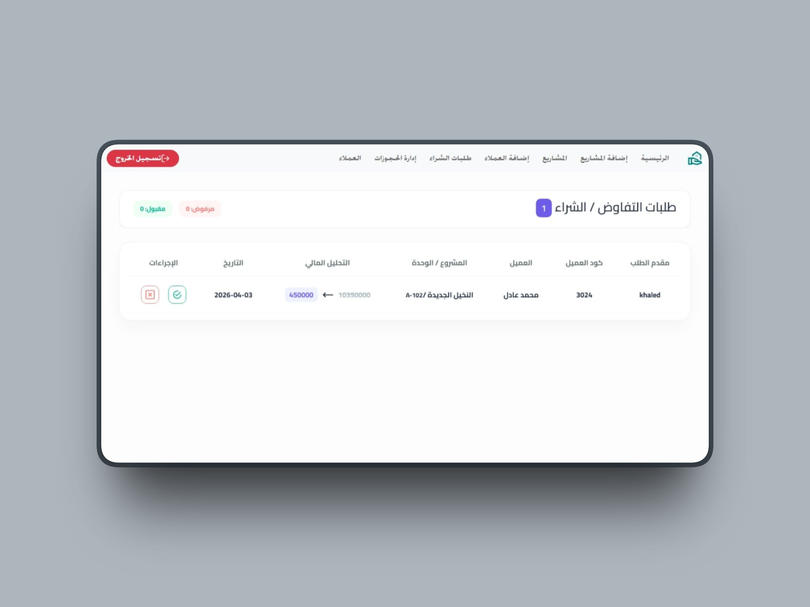
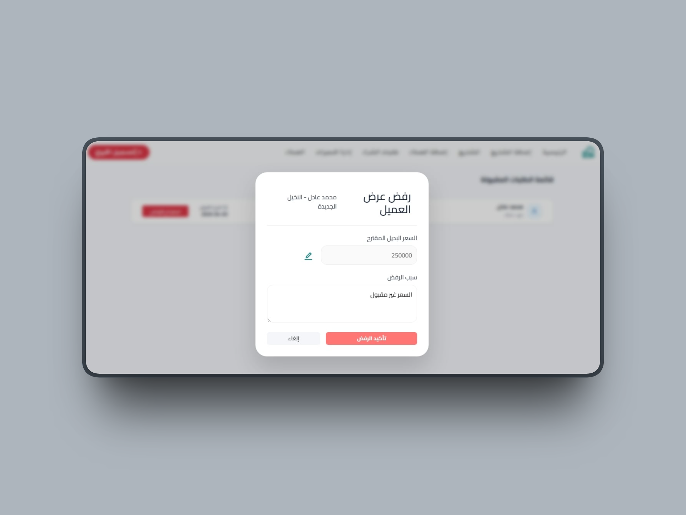
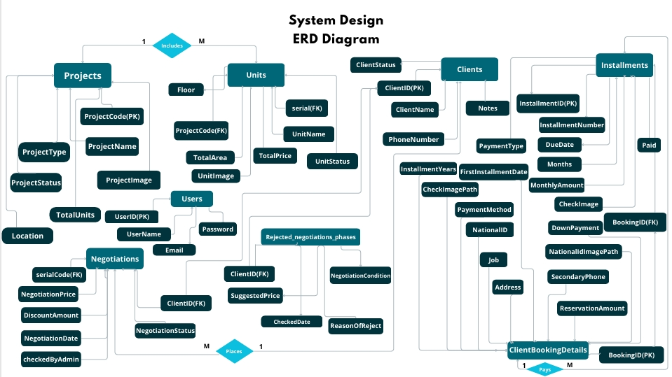
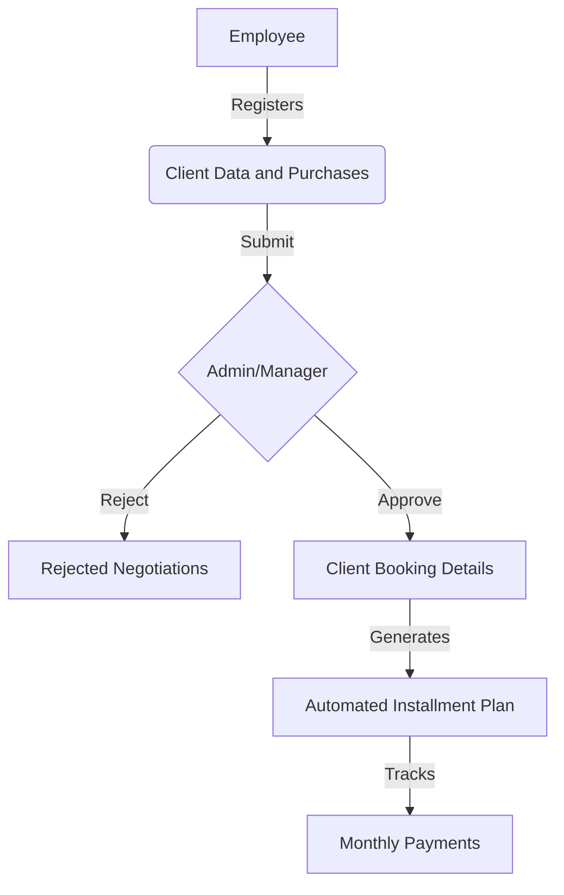

# Real Estate Management System 

A specialized Full-Stack Application designed to digitize real estate operations. This project was inspired by real-world manual workflow challenges to automate project management, client negotiations, and financial installment tracking.
##  Why This Project? (The Problem)
In many real estate agencies, operations like unit bookings and installment tracking are still handled manually on paper. This leads to data inconsistency and slow approval cycles. I developed this system to provide a **Digital Transformation** solution that centralizes data and automates the financial lifecycle of property sales.

##  Tech Stack
* **Frontend:** React.js, Redux Toolkit (Complex State Management),**Bootstrap**,Custom CSS.
* **Backend:** .NET Core Web API (RESTful Services), JWT Authentication, ADO.NET & Entity Framework Core (Hybrid Data Access Layer)
* **Database:** MS SQL Server using EF Core Code-First Approach (Migrations, Data Modeling)
* **Data Visualization:** Chart.js for business analytics.
* **Principles:** Developed with **Clean Code** standards, **SOLID Principles**, and **Focusing on Modular Logic**.
  
##  Core Features
### 1. Secure Access & Role-Based Dashboards (RBAC)
Custom interfaces for **Admins** (Analytics & Approvals) and **Employees** (Sales & Client Entry).

  

### 2. Project & Unit Management (Master-Detail)
Dynamic inventory system allowing Admins to manage massive projects and their individual units (Pricing, Status, Specs).

  
  

### 3. Automated Financial & Installment Engine 
This is the "Brain" of the system. Once a deal is approved:
*   **Dynamic Generation:** Instantly creates a multi-year payment schedule.
*   **Status Tracking:** Real-time monitoring of (Due/Paid) installments.
*   **Voucher Printing:** Generates professional PDF/Printable receipts for clients.

  
  

### 4. Advanced Negotiation Workflow
Integrated "Managerial Decision Engine" where managers can **Approve/Reject** custom price offers submitted by sales staff.

  
  

## Future Logic Enhancements & Roadmap
To show my commitment to **Clean Code** and **Optimization**, I am planning:
* **Dynamic Price Validation:** Implementing a safe range for "Suggested Price" inputs to prevent negative discount rates and ensure logical pricing boundaries during negotiations.
* **Negotiation Data Consistency:** Automating the cleanup of related records in `Rejected_Negotiation_Phases` whenever a negotiation is reset, preventing duplicate log entries for the same unit.
* **Down Payment Safety Bounds:** Adding a validation layer to ensure the "Booking Amount" never exceeds the total "Agreed Price," preventing negative balances in installment schedules.
* **Smart Installment Rounding:** Implementing a custom rounding algorithm (e.g., to the nearest 50 or 100 EGP) to ensure clean and professional payment schedules.

##  Database Architecture & Logic
The system relies on a robust relational schema:
* **One-to-Many:** Projects ➡️ Units.
* **Many-to-One:** Negotiations ➡️ Clients & Units.
* **Automation:** The system pulls validated client data into the booking phase automatically to ensure data integrity and zero manual entry errors. 

###  Database Schema (ERD)
The system relies on a highly normalized relational schema to ensure data integrity.

##  System Workflow (Business Logic)

## 🔧 Installation & Setup
1. Clone the repo: `git clone https://github.com/Toqa-Ashraf8/RealEstate_FullStack_System.git`
2. **Backend:** - Update `appsettings.json` with your SQL connection string.ٍ
   - Run `dotnet ef database update`.
   - Run `dotnet run`.
3. **Frontend:** - Run `npm install`.
   - Run `npm start`.
